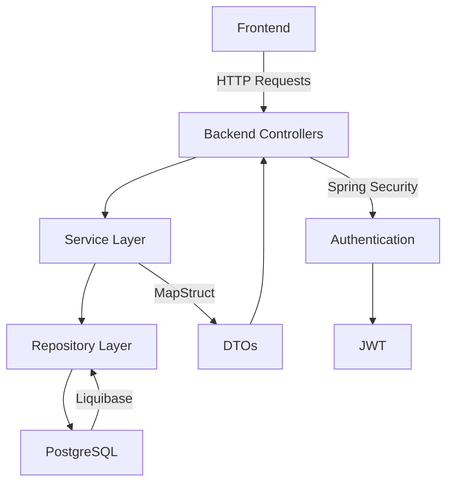

# 🎓 Graduate Work - Платформа объявлений

## 🚀 О проекте

Spring Boot приложение для размещения объявлений с возможностью комментирования. Проект реализует REST API для:

- Регистрации и аутентификации пользователей
- Создания/редактирования объявлений
- Добавления комментариев к объявлениям
- Загрузки изображений для объявлений и аватарок

Фронтенд-часть реализована на React и работает в связке с бэкендом.

## 📚 Содержание

- [Технологии](#🔧-технологии)
- [Команда](#👥-команда)
- [Запуск проекта](#🚀-запуск-проекта)
- [Миграции БД](#📊-миграции-бд)
- [API Endpoints](#🌐-api-endpoints)
- [Архитектура решения](#🏗️-архитектура-решения)
- [Особенности реализации](#✨-особенности-реализации)

## 🔧 Технологии

### Backend

- **Java 17**
- **Spring Boot 3.1.5**
- **Spring Security** (аутентификация и авторизация)
- **PostgreSQL 15** (реляционная БД)
- **Liquibase** (управление миграциями БД)
- **MapStruct** (маппинг DTO ↔ Entity)
- **Lombok** (автогенерация кода)
- **Spring Data JPA** (репозитории)
- **Spring Web** (REST контроллеры)
- **Spring Validation** (валидация данных)

### Frontend

- **React 18**
- **Docker** (контейнеризация фронтенда)

## 👥 Команда

- [**Артем Гулян**](#https://GitHub.com/Diplineru)
- [**Игорь Слепухин**](#https://github.com/Black-1977)
- [**Сергей Шишкин**](#https://GitHub.com/SFS76)

## 🚀 Запуск проекта

### Предварительные требования

- Установленный Docker
- Java 17 JDK
- Maven 3.8+
- PostgreSQL 15+

### Шаги запуска:

1. **Запуск PostgreSQL в Docker:**
   ```bash
    docker run --name grad-db -e POSTGRES_PASSWORD=password -p 5432:5432 -d postgres:15

2. **Запуск фронтенда в Docker:**
   ```bash
    docker run -p 3000:3000 --rm ghcr.io/dmitry-bizin/front-react-avito:v1.21

3. **Клонирование репозитория:**
    ```bash
    git clone https://github.com/DiplineRU/Graduate-work.git
    cd Graduate-work
4. **Настройка БД:**

- Создать БД: graduate_work
- Обновить настройки в src/main/resources/application.yml:
    ```bash
    spring:
    datasource:
    url: jdbc:postgresql://localhost:5432/graduate_work
    username: postgres
    password: password

5. **Сборка и запуск бэкенда:**
    ```bash
   mvn clean package
   java -jar target/graduate-work-1.0.0.jar
6. **Доступ к приложению:**

- Бэкенд: http://localhost:8080
- Фронтенд: http://localhost:3000
- Swagger UI: http://localhost:8080/swagger-ui/index.html

## 📊 Миграции БД

Управление схемой БД осуществляется через Liquibase. Все миграции находятся в директории:
   ```bash
   src/main/resources/db/changelog/
```
При запуске приложения автоматически применяются все новые изменения из файлов:

- db.changelog-master.yaml
- db.changelog-v1.0.yaml

## 🌐 API Endpoints
Основные конечные точки API:

| Метод | URL         | Действие               |
|-------|-------------|------------------------|
| POST  | `/login`    | Аутентификация пользователя	Гость          |
| POST  | `/register` | Регистрация нового пользователя	Гость |
| GET   | `/ads`      |Получить все объявления	Пользователь|
| POST  | `/ads`      |		Создать новое объявление	Пользователь|
| GET   | `/ads/{id} `|  		Получить объявление по ID	Пользователь|
| PATCH | `/ads/{id} `|  		Обновить объявление	Админ/Автор|
| GET   |`/ads/{id}/comments `|  		Получить комментарии к объявлению	Пользователь|
| POST  | `/ads/{id}/comments `|  		Добавить комментарий	Пользователь|
| PATCH | `/users/me `|  		Обновить профиль пользователя	Пользователь|
| POST  | `/users/me/image `|  		Загрузить аватар пользователя	Пользователь|

## 🏗️ Архитектура решения

## ✨ Особенности реализации

1. **Безопасность:**
- Реализована аутентификация через JWT
- Авторизация на основе ролей (USER, ADMIN)
- Защита от CSRF-атак
- Шифрование паролей с помощью BCrypt

2. **Работа с изображениями:**
- Загрузка изображений для объявлений
- Обновление аватарок пользователей
- Хранение изображений в файловой системе

3. **Валидация данных:**
- Аннотации валидации для DTO
- Кастомные обработчики исключений
- Проверка прав доступа к операциям

